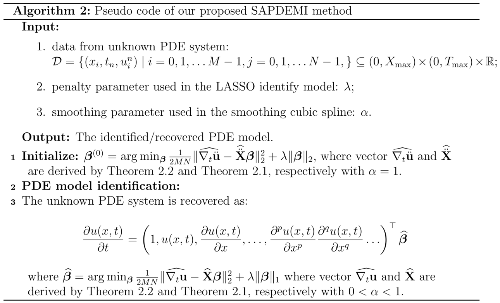
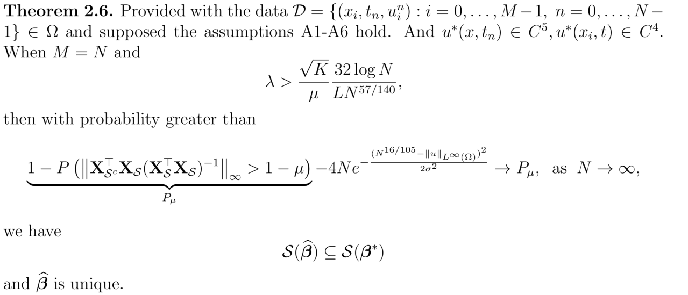
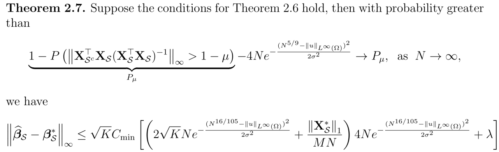
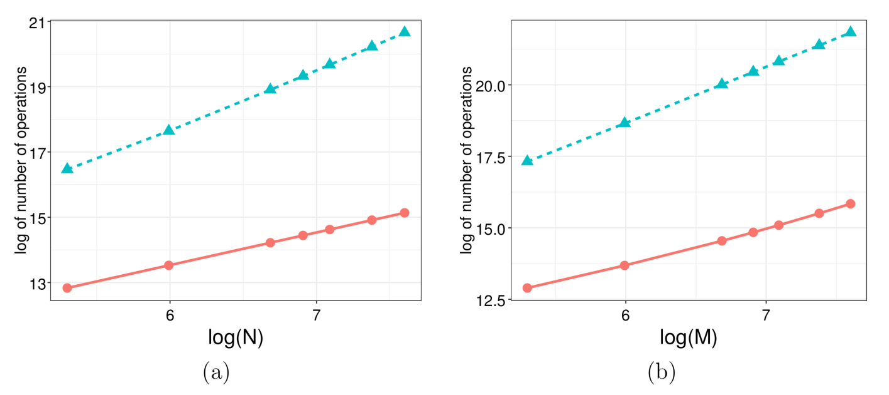
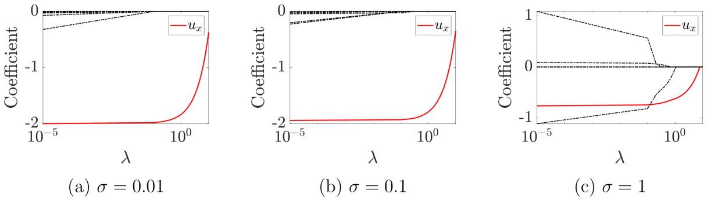
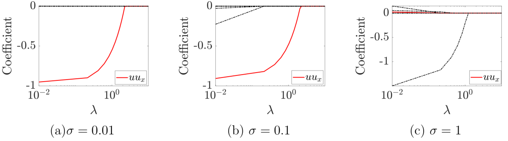
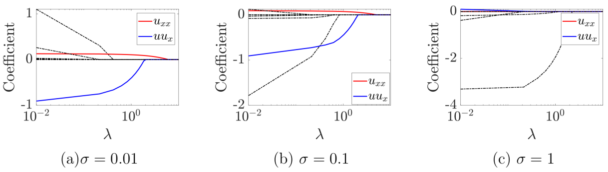

# ZhaoPDEident2020
**Contents of This Repo:**
- Purpose
- Our Prospsed SEPDEMI Method
- Main Theorem
- Numerical Experiments
- Folder illustration

## Purpose


## Our Prospsed SEPDEMI Method


## Main Theorem

### Main Theorem 1:


### Main Theorem 2:


### Main Theorem 3:


## Numerical Experiments
We carry out two simulations to validate our main theory:
 - Simulation 1: Verify the Computational Complexity
 - Simulation 2: PDE Recovery 

**NOTE**: Before running the following code, please make sure that you have download the `CountFLOP`  and `SAPDEMI` folders.


### Simulation 1: Verify the Computational Complexity
This simulation is to validate the computation complexity of our proposed SEPDEMI method to derive the initial point in Line 2 of the above pusedo algorithm is of order 
<a href="https://www.codecogs.com/eqnedit.php?latex=O(MN)" target="_blank"></a>.
However, other method, such as XX, requires 
<a href="https://www.codecogs.com/eqnedit.php?latex=\max{O(&space;MN^{2}&space;),&space;O(M^{2}N),&space;O(125MN)}" target="_blank"></a>


The PDE considered in this example is the transport equation:

<a href="https://www.codecogs.com/eqnedit.php?latex=\partial_t&space;u(x,t)&space;=&space;-2&space;\partial_x&space;u(x,t)" target="_blank"></a>

with 
<a href="https://www.codecogs.com/eqnedit.php?latex=u(x,0)&space;=&space;2\sin(4x)" target="_blank"></a>
 and
 <a href="https://www.codecogs.com/eqnedit.php?latex=X_{\max}&space;=1" target="_blank"></a>,
 <a href="https://www.codecogs.com/eqnedit.php?latex=T_{\max}&space;=1" target="_blank"></a>.
 

By ranging `xNum ` and `tNum` in the following code, you could generate the following tables.

``` Matlab
addpath(genpath('CountFLOP'))
addpath(genpath('SAPDEMI'))

clear all
clc
sigma = 0.01;
xNum  = 20;
tNum  = 200;
xMax  = 1; 
tMax  = 0.1;
[uNoise, uTure, xData, tData, length_X, length_T] = PDE_data_generation(xNum, tNum, xMax, tMax, sigma, 'transport');
lambda = 1e-2;
%%% Calculate the computational complexity of our method
profile on
[beta_ridge, y_ridge, X_ridge] =  cubic_spline_ridge_regression(uNoise, xMax, xNum, tMax, tNum, lambda, 0);
profileStruct = profile('info');
[flopTotal, Details] = FLOPS('cubic_spline_ridge_regression', 'info.mat', profileStruct);
%%% Calculate the computational complexity of Namjoon's method
profile on
[beta_ridge, y_ridge, X_ridge] =  local_poly_ridge_regression(uNoise, xMax, xNum, tMax, tNum, lambda, 0);
profileStruct = profile('info');
[flopTotal, Details] = FLOPS('local_poly_ridge_regression', 'info.mat', profileStruct);
```

When the spatial resolution is fixed as 20, and we let the temporal resolution ranges from 200 to 2000, we generate the following table:

|      N        | 200  | 400 | 800 | 1000 | 1200 | 1600 | 2000|
| :---:          | :-: | :-: | :-: | :-: | :-: | :-: | :-: |
| SAPDEMI | 374389 | 748589 | 1496989 | 1871189 | 2245389 | 2993789 |3742189|
| local ploy | 14136936 | 45854336 | 162089136 | 246606536 | 348723936 | 605758736 | 933193536 |

When the temporal resolution is fixed as 20, and we let the spatial resolution ranges from 200 to 2000, we generate the following table:

|      M        | 200  | 400 | 800 | 1000 | 1200 | 1600 | 2000|
| :---:          | :-: | :-: | :-: | :-: | :-: | :-: | :-: |
| SAPDEMI | 398573 | 875773 | 2070173 | 2787373 | 3584573 | 5418973 | 7573373 |
| local ploy | 33046336 | 125596136 | 489255736 | 760365536 | 1090995336 | 1930814936 | 3008714536 |

The above table is visualized in the following plots, where plot (a) is the visualization of the first table and plot (b) is the visualization of the second table.
The x-axis is the logarithm of M/N, and the y-axis is the logarithm of the computational complexity.




### Simulation 2: Varify the Support Set Recovery 
 In this experiment, we apply our proposed SAPDEMI method to identify classical PDE models under noised observations.
 Transport equation and Burger's equation are considered, since both of them plays a fundamental role in modeling physical phenomenon and demonstrate characteristic behaviors shared by more complex system, such as dissipation and shock-formation.
 For both transport equation and Burger's equation, we aim to answer analyze the effect of noise on PDE identification.


#### Example 1: Transport Equation
The PDE considered in this example is the transport equation:

<a href="https://www.codecogs.com/eqnedit.php?latex=\partial_t&space;u(x,t)&space;=&space;-2&space;\partial_x&space;u(x,t)" target="_blank"></a>

with 
<a href="https://www.codecogs.com/eqnedit.php?latex=u(x,0)&space;=&space;2\sin(4x)" target="_blank"></a>
 and
 <a href="https://www.codecogs.com/eqnedit.php?latex=X_{\max}&space;=1" target="_blank"></a>,
 <a href="https://www.codecogs.com/eqnedit.php?latex=T_{\max}&space;=1" target="_blank"></a>.
 
 The only correct feature variable should be selected is <a href="https://www.codecogs.com/eqnedit.php?latex=\partial_x&space;u(x,t)" target="_blank"></a>. 
 The following code can selecting the correct freature variable.

**Implement Struction:**
By ranging `sigma = 0.01` or `sigma = 0.1` or `sigma = 1` in the following code, you could generate the following three plots.
``` Matlab
addpath(genpath('SAPDEMI'))

clear all
clc
sigma = 0.01;
xNum  = 100;
tNum  = 40;
xMax  = 1; 
tMax  = 0.1;
lambda = linspace(1e-5,10,100);
[uNoise, uTure, xData, tData, length_X, length_T] = PDE_data_generation(xNum, tNum, xMax, tMax, sigma, 'transport');
[beta_lasso, y_lasso, X_lasso, fitinfo] = cubic_spline_lasso_regression(uNoise, xMax, xNum, tMax, tNum, lambda, 1, 1, 0.8);
%%% plot the LASSO estimation results
figure
for i = 1:size(beta_lasso,1)
    if i == 3
        h1 = semilogx(fitinfo.Lambda, beta_lasso(i,:),'LineWidth',2,'Color','r');
    else    
        semilogx(fitinfo.Lambda, beta_lasso(i,:),'-.','Color','k','LineWidth',1.5)
    end
    hold on
end
xlabel('$\lambda$','Interpreter','Latex')
ylabel('Coefficient','Interpreter','Latex')
hleg1 = legend([h1],{'$u_{x}$'},'Interpreter','Latex');
set(gca,'TickLabelInterpreter','latex')
set(gca,'fontsize',30)

```




#### Example 2:  inviscid Burgers' Equation
The PDE considered in this example is the  inviscid Burgers' Equation:

<a href="https://www.codecogs.com/eqnedit.php?latex=\partial_t&space;u(x,t)&space;=&space;-0.5&space;u(x,t)&space;\partial_x&space;u(x,t)" target="_blank"></a>

with 
<a href="https://www.codecogs.com/eqnedit.php?latex=u(x,0)&space;=&space;\sin(2\pi&space;x)" target="_blank"></a>
and
 <a href="https://www.codecogs.com/eqnedit.php?latex=u(0,t)&space;=&space;u(1,t)&space;=&space;0" target="_blank"></a>
 with
 <a href="https://www.codecogs.com/eqnedit.php?latex=X_{\max}&space;=1" target="_blank"></a>,
 <a href="https://www.codecogs.com/eqnedit.php?latex=T_{\max}=0.1" target="_blank"></a>.
 The following code can selecting the correct freature variable.
 
**Implement Struction:**
By ranging `sigma = 0.01` or `sigma = 0.1` or `sigma = 1` in the following code, you could generate the following three plots.

``` Matlab
addpath(genpath('SAPDEMI'))

clear all
clc
sigma = 0.01;  %% you can change 'sigma' into 0.01, 0.1 or 1 to generate the following plots
xNum  = 50;
tNum  = 50;
xMax  = 1; 
tMax  = 0.1;
lambda = linspace(1e-2,10,100);
[uNoise, uTure, xData, tData, length_X, length_T] = PDE_data_generation(xNum, tNum, xMax, tMax, sigma, 'inviscid Burger');
[beta_lasso, y_lasso, X_lasso, fitinfo] = cubic_spline_lasso_regression(uNoise, xMax, xNum, tMax, tNum, lambda, 1, 1, 0.8);
%%% plot the LASSO estimation results
figure
for i = 1:size(beta_lasso,1)
    if i == 8
        h1 = semilogx(fitinfo.Lambda, beta_lasso(i,:),'LineWidth',2,'Color','r');
    else    
        semilogx(fitinfo.Lambda, beta_lasso(i,:),'-.','Color','k','LineWidth',1.5)
    end
    hold on
end
xlabel('$\lambda$','Interpreter','Latex')
ylabel('Coefficient','Interpreter','Latex')
hleg1 = legend([h1],{'$uu_{x}$'},'Interpreter','Latex');
set(gca,'TickLabelInterpreter','latex')
set(gca,'fontsize',30)

```



#### Example 3: viscous Burgers' Equation
The PDE considered in this example is the  viscous Burgers' Equation:

<a href="https://www.codecogs.com/eqnedit.php?latex=\partial_t&space;u(x,t)&space;=&space;-0.5&space;u(x,t)&space;\partial_x&space;u(x,t)&space;&plus;&space;0.1&space;\partial_x^2&space;u(x,t)" target="_blank"></a>

with 
<a href="https://www.codecogs.com/eqnedit.php?latex=u(x,0)&space;=&space;\sin^2(4\pi&space;x)&space;&plus;&space;\sin^3(2\pi&space;x)" target="_blank"></a>
and
 <a href="https://www.codecogs.com/eqnedit.php?latex=u(0,t)&space;=&space;u(1,t)&space;=&space;0" target="_blank"></a>
with 
<a href="https://www.codecogs.com/eqnedit.php?latex=X_{\max}&space;=1" target="_blank"></a>,
<a href="https://www.codecogs.com/eqnedit.php?latex=T_{\max}=0.1" target="_blank"></a>.

The following code can selecting the correct freature variable.
**Implement Struction:**
By ranging `sigma = 0.01` or `sigma = 0.1` or `sigma = 1` in the following code, you could generate the following three plots.

``` Matlab
addpath(genpath('SAPDEMI'))

clear all
clc
sigma = 0.01; %% you can change 'sigma' into 0.01, 0.1 or 1 to generate the following plots
xNum  = 50;
tNum  = 50;
xMax  = 1; 
tMax  = 0.1;
lambda = linspace(1e-2,10,100);
[uNoise, uTure, xData, tData, length_X, length_T] = PDE_data_generation(xNum, tNum, xMax, tMax, sigma, 'viscous Burger', 0.1);
[beta_lasso, y_lasso, X_lasso, fitinfo] = cubic_spline_lasso_regression(uNoise, xMax, xNum, tMax, tNum, lambda, 1, 1, 0.8);
%%% plot the LASSO estimation results
figure
for i = 1:size(beta_lasso,1)
    if i == 4
        h1 = semilogx(fitinfo.Lambda, beta_lasso(i,:),'LineWidth',2,'Color','r');
    elseif i == 8
        h2 = semilogx(fitinfo.Lambda,beta_lasso(i,:),'LineWidth',2,'Color','b');
    else    
        semilogx(fitinfo.Lambda, beta_lasso(i,:),'-.','Color','k','LineWidth',1.5)
    end
    hold on
end
xlabel('$\lambda$','Interpreter','Latex')
ylabel('Coefficient','Interpreter','Latex')
hleg1 = legend([h1, h2],{'$u_{xx}$', '$uu_{x}$'},'Interpreter','Latex');
set(gca,'TickLabelInterpreter','latex')
set(gca,'fontsize',30)

```



## Folder illustration
`latex manuscript` contains the pdf, latex, bib files; 

`code` contains the code used for simulations;

`reference` contains the pdf reference I cited in the paper;

`Meeting Agenda` is the PPT that I used for the joint meeting with my advisors.

